# PORTFOLIO PROJECT - 3

# NUMBEREX

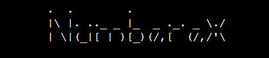

## PURPOSE

'Numberex' is a number guessing game where either you (the user) guesses the AI number, or the AI tries to guess the number you are thinking of. The project has been developed using the Python programming language to create a command line application that demonstrates the skills I have learnt.
* Here is a link to the [final project](https://numberex.herokuapp.com/)

## INITIAL IDEA CONCEPT

My initial idea for the project was to create a number guessing game to play against the computer or let the computer guess the user's number.
The upper number limit can be chosen by the user for personalised difficulty.
#  
## CONTENTS

- [USER STORIES](#user-stories)
- [FEATURES](#features)
    - [Flowchart](#flowchart)
    - [Game Components](#the-game-consists-of)
        - [User vs AI](#user-vs-ai)
        - [AI vs User](#ai-vs-user)
    - [Future Features](#future-features)
    - [Images](#images)
    - [Typography](#typography)
- [TESTING](#testing)
    - [Validation](#validation)
        - [PEP8](#pep8-online-validation)
- [MANUAL TESTING](#manual-testing)
    - [Solved bugs and errors](#solved-bugs-and-errors)
    - [Unsolved bugs and errors](#unsolved-bugs-or-errors)
- [TECHNOLOGIES](#technologies)
    - [Development](#development)
    - [Languages used](#languages-used)
    - [Libraries used](#libraries-used)
- [DEPLOYMENT](#deployment)
- [CREDITS AND REFERENCES](#credits-and-references)
- [ACKNOWLEDGEMENTS](#acknowledgements)

#

## USER STORIES

* As a user, I want the game to have varying difficulty
* As a user, I want to easily understand the main purpose of the game
* As a user, I want a choice of games
* As a user, I want to be able to see how many lives I have left
* As a user, I want the option to play again

## FEATURES

* The Features I want the game to have are:
    * Allow the user to guess a number between 1 and (a number chosen by the user)
    * To give an aspect of difficulty with 5 'lives' or attempts
    * If either game is lost or finished, the user will be presented with a restart game option

## Flowchart

Gameplay Flowchart image

 

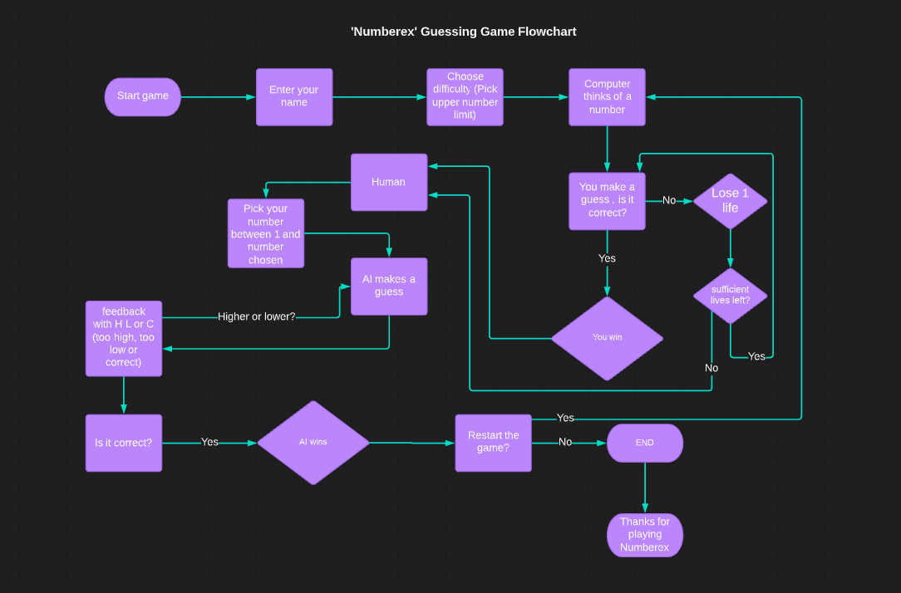

### The Game consists of:
#### User vs AI

* A terminal with the title `Numberex` and `Enter your name:`

* Once the user name has been entered, `Please choose upper limit` appears

* The user has the option to choose the highest number they wish

* The user is then presented with game rules

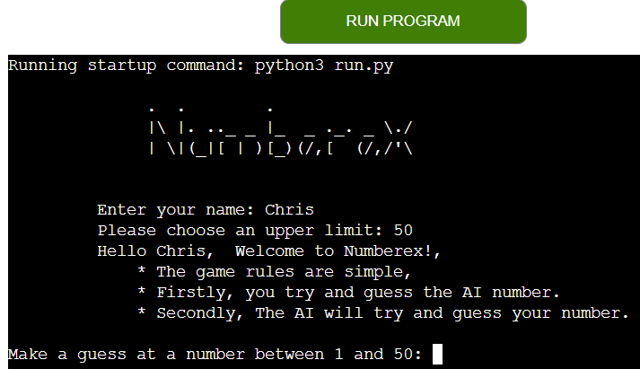

* The game starts with `Make a guess between 1 and (number chosen)`

* The user makes a guess, and the game checks if it is correct,
    If the user makes an incorrect guess, they lose a life and must guess again

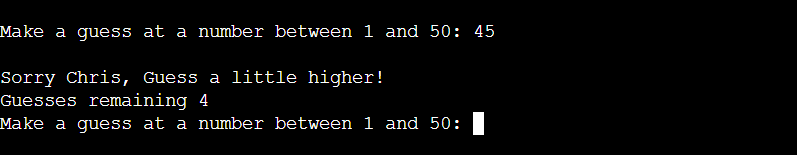

* If the user has run out of guesses, `Sorry, you ran out of guesses` AI tells the user the number and the game moves to AI guessing

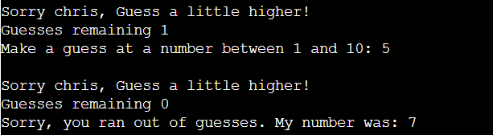

* If the user made the correct guess, they win and the turn moves to AI guessing

### AI vs User

* The user now thinks of a number between 1 and (original number chosen)
* The AI asks the user `MY turn!! Is your number (AI Guess)`

* If the user thinks it is too high, press `h`

* if too high, AI guesses again
* If the user thinks it is too low, press `l`

* If too low, AI guesses again
* If the user thinks the AI guess is correct, press `c`

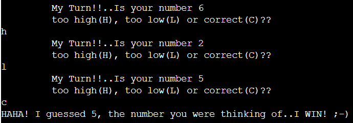

* If correct, AI shows off by telling you they won
* Option for `Do you want to restart the game [Y/N]` appears

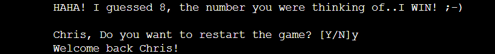

* If the user enters `y`, Game restarts to `Make a guess between 1 and (number chosen)`

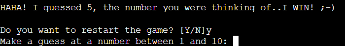

* If the user enters `n`, Game ends with `Thank you for playing Numberex!`

### Future features:

* Add AI Guesses (lives) left
* Add an option to choose between AI vs User or User vs AI
* Add how many lives the User or AI had left once correctly guessed the number

### Images

* There is one background image, for aesthetics only
    [IStockphoto](https://www.istockphoto.com/search/2/image?phrase=numbers)

### Typography

* The project uses [Pyfiglet](http://www.figlet.org/examples.html) for the ascii art (title)
* Otherwise, Standard terminal font, cannot be changed.
# 

# TESTING

* `As a user, I want the game to have varying difficulty`:
    *  After the user inputs his/her name, The option to choose `highest number` will appear to
        provide a personalised level of difficulty. Outcome: `Fulfilled.`
* `As a user, I want to easily understand the main purpose of the game`:
    * Once the user has entered his/her name, and made a choice of difficulty, 
        there will be a paragraph on what the game entails. Outcome: `Fulfilled.`
* `As a user, I want a choice of games`:
    * I have provided two games that run consecutively,
        First: User to guess the AI number
        Second: Ai to guess User number. Outcome: `Fulfilled.`
* `As a user, I want to be able to see how many lives I have left`:
    * After each guess from the user, the terminal will print how many lives (guesses)
        the user has remaining, counting down from five. Outcome: `Fulfilled.`
* `As a user, I want the option to play again`:
    * I have provided an option at the end of the game that asks 
        `Do you want to restart the game? [Y/N]`
        If the user inputs `y`, the game restarts to 
        the User vs AI with the original input difficulty. 
        If the user inputs `n` the game ends with a message 
        `Thank you for playing Numberex!`. Outcome: `Fulfilled.`

## Validation
### PEP8 Online Validation

PEP8 Screenshot Results for game run file

 

# MANUAL TESTING

- Upon loading the game screen terminal:
    - The user is greeted with `Enter your name: `, Although it is out of my power for a user to input random letters or 
        characters rather than a name,
        I have made sure that any spaces before or after the input are stripped after the user presses enter. For example:
        
    - After enter is pressed, the users name should appear without whitespace along with the game rules
        This always prints at the start of the game after the user has input a name and pressed enter
    - At the same time the game rules print out to the terminal, a statement appears to enable the user to choose a high 
        number in order to make the game more difficult:
        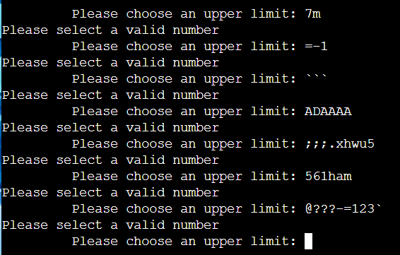
    - As you can see in the image above, I have input several letters, characters and combinations of both including numbers, 
        validation always catches the fact the input is not a number or integer, it prints the statement 
        `Please select a valid number` and then re-prints the statement `Please choose an upper limit: `
    - When the correct value (number) is input into the terminal for `Please choose an upper limit: ` i.e. `10`, 
        enter is pressed and a new line with message `Make a guess at a number between 1 and 10:`
        - I have input words, strings of words, individual letters, characters, and pressed enter, but with validation, 
            I cannot input anything other than a number. A message appears `Sorry, Chris, That is not a number!`:
        - 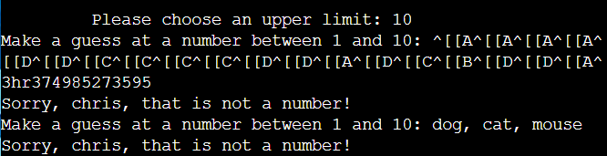
    - For the sake of this test the upper limit is 10. If I try to input a number outside of the set limits (1 to 10), 
        in this case `15000`, the issue is caught with the following message `Please choose a number between 1 and 10:`
    - When the correct value is entered for this part of the game (a guess between 1 and 10) but the guess is too low,
        the game sees that the number is too low and prints out the statement `Sorry Chris, guess a little higher!`
    - The terminal prints again `Make a guess at a number between 1 and 10:`
    - The code then recognises one guess has been made out of five and prints out `..Guesses Remaining: 4`
    - When the correct value is entered but the guess is too high,
        the game sees that the number is too high and prints out the statement `Sorry Chris, guess a little lower!`
    - The terminal prints again `Make a guess at a number between 1 and 10:`
    - The code then recognises two guesses have been made out of five and prints out `..Guesses Remaining: 3`
    - 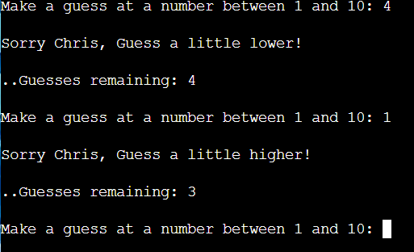
    - If I keep inputting the same number until the lives have run out, The terminal prints, 
        - `Sorry you ran out of guesses, my number was: (example number)`
        - Then the game moves to the AI guessing my number.
    - But, if I guess the correct number within the limits, I win with a message 
        - `Well done, You guessed the correct number: (Example number)`
    
- The next part of the game is, I have to guess the number the AI is thinking of,
    - `My Turn!!.. Is your number (in this case) 9?`
            - `too high(H) too low(L) correct(C)`
    - For this test I forced the AI higher by the input of `too low(L)`
    - The AI printed:
    - `My Turn!!.. Is your number 10?`
        - `too high(H) too low(L) correct(C)`
    - Again, my input was `too low(L)`
        - With validation in my code I am able to catch a user forcing past the upper and lower limits with a 
            try/except rule and the following happens:
        - 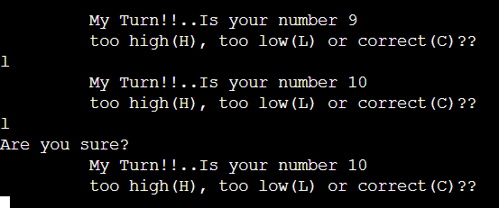
    - If I input `too low(L)` one more time, the code is written to prevent cheating and the terminal prints a statement 
        - `I think you are cheating I am not playing this game with you anymore!`
        - 
    - This test is also the same when entering `too high(H)` and trying to force the AI past 1 and lower.
    - The game then ends with a final statement `Chris, Do you want to restart the game? [Y/N]`
        - If I input anything other than `y` or `n` the game exits and the `"RUN PROGRAM"` button must be pressed to start the game again.
            - This is a flaw that needs validation to prevent the user inputting a value anything other than `y` or `n`
    - When I type `y`, The code has stored the name to reinsert into the print statement `Welcome back, (name)!`
    - The game then loops back to the `User vs AI` But this time there is no option to input a higher number,
        - This is something I would like to implement for future development of the game
    - When I type `n` The game simply ends with message `Thankyou for playing Numberex!`
    - For the sake of testing, If none of the above is true, (no cheating, no incorrect values etc) the AI has 
        infinite guesses to find the number I am thinking of.
        - This is flaw I came across while carrying out manual testing, I would like to in future development (with more time), 
            include AI guess limit function.
    - If the number I am thinking of matches the AI guess, I input `correct(c)` and I am greeted with a message:
        - `HAHA!! I guessed (number) The number you were thinking of.. I WIN!!` 
        - .png)
    - And finally the option to restart the game appears, If I press `y`, the loop starts again, if I press `n`, the game exits.

## Solved bugs and errors

* Throughout the development of this project, several automated (flake8) errors have been fixed i.e.
    - Indentation errors
    - Undefined variable name
    - Not enough whitespace between functions
    - No new line at end of file
    - Invalid syntax errors
    - Imported but unused errors
    

* Found an issue with `AI vs user`, where there was a double input of the user controls of `H L or C`, for example,
    if the user is thinking of 5 and AI guessed 4, the user would input H for higher, but two H H would appear on seperate lines.
    - This was fixed by removing a missed duplicate print() statement.
* Found an issue with restart game function, the option to restart the game would appear during the `AI vs User` game,
    or wouldn't appear at all.
    - This was a complete oversight, I had simply placed the function at the end of the file, logically, the `end_game()` function needed to be placed above `user_guess` and `computer_guess` functions in order to be called after the game ended.
    - Importing `sys` for `sys.exit()` also cured the issue of the game not ending in the same function.
* Any duplicate or unused code, comments etc have been removed
* Any irrelevant space in between code has been removed

## Unsolved bugs and errors

* When the game comes to an end and the user requests to restart the game, the game loops back to User vs AI, 
    without the possibility of inputting a new number for difficulty purposes. The game does run as normal apart from this issue
* If the user types anything other than `y` or `n` at the restart game section, the game just exits and the only way to play again
    is to press the run program button at the top of the page
* All previously known errors during the development process have been resolved

#
# TECHNOLOGIES

## DEVELOPMENT

* The project was written and tested using [Gitpod](https://gitpod.io/)
* The project uses [Github](https://github.com/) for utilising git version control
* The project was deployed via [Heroku](https://heroku.com/)

## LANGUAGES USED

* The project was written using [PYTHON3](https://en.wikipedia.org/wiki/Python_(programming_language))

## LIBRARIES USED

* Pyfiglet
    - This library was used to create the ASCII art for the title upon loading the game
        
* Random
    - randint was used to generate a random number for the game

* Sys
    - sys was imported for the exit and restart function of the game
#
# DEPLOYMENT

## Heroku

* This Game was deployed using [Heroku](https://heroku.com/) with the following the steps:

1. Navigate to [Heroku.com](https://www.heroku.com/) and log-in or create a new account.
2. On the top right hand side, click the 'New' button.
3. Inside the dropdown menu, select 'Create new app'.
4. Create a new name for your app (making sure the name chosen is available) in this case it is `numberex`.
    App names can only be in lower-case letters, numbers and dashes.
5. Select your region, in this case, `Europe`.
6. Click on the `Create App` button.  
7. This will create your app in Heroku and take you to the [Heroku](https://heroku.com/) dashboard.
8. Navigate to the settings tab and scroll down to the button `Reveal Config vars`.
9. Replace the word `KEY` and enter `PORT` and then replace the word `VALUE` and enter `8000` then click on the `Add` button.
10. Below `Config vars` is `Buildpacks`. Click the `Add Buildpack` button.
11. In the pop up window, select `python` and save changes.
12. Repeat this again but this time selecting `node.js` and save the changes.
13. It is `important` to make sure the buildpacks are in the correct order 
    with `Python` being at the top and `node.js` bottom. If they are not in the correct order, you can drag them into the right order.
14. Next, navigate to the `Deploy` tab at the top left side.
15. Select `Github, 'connect to github'` as the deployment method.
16. Search for the Github Repository in the search field (in this case `Python_PP3`) and click `Search`.
17. When the search is complete, click `connect`.
18. Once your repository is connected to [Heroku](https://heroku.com/), Click the `Enable Automatic Deploys` button for automatic deployment.
19. Alternatively you can manually deploy by selecting a branch to deploy from and clicking `Deploy Branch`.
20. If you choose to `Enable Automatic Deploys`, [Heroku](https://heroku.com/) will build a new version of the app when a change to 
    `gitpod` is pushed to `Github`.  
21. Manual deployment allows you to update the app whenever you click `Deploy Branch`.
    In the case of this project, I chose to `Enable Automatic Deploys` to ensure the code was deployed straight away at each push from `Gitpod`.
22. Once the build process is complete (this can take a few seconds) you will then be able to view the live app by clicking on the button `View`
    below `Your app was successfully deployed`.

## Version control

* These commands were used for version control during project:

    * git add `example filename` - to add files before committing
    * git commit -m `"example message"` - to commit changes to the local repository
    * git push - to push all committed changes to the GitHub repository
    * git branch - to see which branch currently working on
    * git pull - to pull all code into main branch once the feature branch had been merged and deleted
    * git status - to see if the branch currently working on is upto date or if the are any unstaged
    * git log --oneline - to see the last commit
    * git commit --amend - to amend the most recent commit message

## How to create a branch/Tag of main:

If you need to `BRANCH` off of the main repository:

1. If you have not already, login in to [GitHub](www.github.com) and go to https://github.com/Chr15w1986/Python_PP3
2. On the left side of the screen underneath the nav links, click the drop down box `Main`
3. Inside the box you will see `Create new branch/tag`
4. Inside the text box, enter the new branch or tag name i.e., `Features`
5. Below the Branches Tags tab, you will see `Create branch: Features from "main"`
6. Click on `Create branch: Features from "main"` and you will be taken to the new branch page you just called `Features`

## How to fork a repository:

If you need to `FORK` a repository:

1. If you have not already, login in to [GitHub](www.github.com) and go to https://github.com/Chr15w1986/Python_PP3
2. In the top right corner, click `Fork`
3. The next page will be the forked version of https://github.com/Chr15w1986/Python_PP3 but in your own repository
## How to clone a repository:

If you need to make a clone of this repository:

1. Fork the repository https://github.com/Chr15w1986/Python_PP3 using the steps above
2. Above the file list, click `Code` (Usually green at the top right of the code window)
3. Choose if you want to clone using HTTPS, SSH or GitHub CLI, then click the copy button to the right
4. Open Git Bash
5. Change the directory to where you want your clone to go (your own github)
6. Type `git clone` and then paste the URL you copied in step 4
7. Press `Enter` to create your clone

## How to make a local clone:

If you need to make a local clone:

1. If you have not already, login in to [GitHub](www.github.com) and go to https://github.com/Chr15w1986/Python_PP3
2. Under the repository name, above the list of files, click `Code`
3. Here you will have two options, `Clone` or `Download` the repository
4. You should close the repository using HTTPS, clicking on the icon to copy the link
5. At this point, you can launch the `Gitpod workspace` or choose your own directory
5. Open Git Bash
6. Change the current working directory to the new location of where you want the cloned directory to be
7. Type git clone and then paste the URL you copied in step 4
8. Press Enter, to create your local clone to your chosen directory

#
## CREDITS AND REFERENCES

### IMAGE

* Background image of numbers collage, [IStockphoto](https://www.istockphoto.com/search/2/image?phrase=numbers)

### CODE

* [W3Schools](https://www.w3schools.com/) for an interesting read on python functions and how they can be implemented.
* [Stackoverflow](https://stackoverflow.com/questions/57409696/imported-but-unused-in-python) For an unused import error I was experiencing.
* [Stackoverflow](https://stackoverflow.com/questions/27076239/adding-scoring-system-to-a-number-guessing-game-including-play-again)
    For a rough guide on how to implement a restart game function.

#
## ACKNOWLEDGEMENTS:

- Code institute for the amazing Tutors on the course
- My brilliant Mentor Ben Kavanagh, [BAK2K3](https://github.com/BAK2K3) for his brilliant advice on my code, Pushing me back on track 
    when I start to lose faith, Taking time out of his own day and duties to answer ALL of my questions with utter perfection!
- Dave Horrocks [DaveyJH](https://github.com/daveyjh), Again! for giving me time out of his own studies, for his patience, helping me above and beyond.
- Shellie Downie [ShellieD](https://github.com/shellieD), For her support, Pointing out an obvious issue with my code so quickly.. TWICE! after hours of staring at it and looking straight over the problem.
- My family for their support, patience and testing!!
- My wonderful fiancée for being my personal spell checker/Grammer police and for listening to me when I need to rant!
- Everybody on Slack for tips, advice, quick fixes and support

#### RETURN TO THE [TOP](#numberex)
