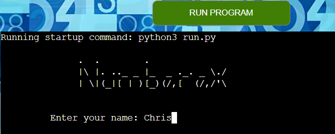
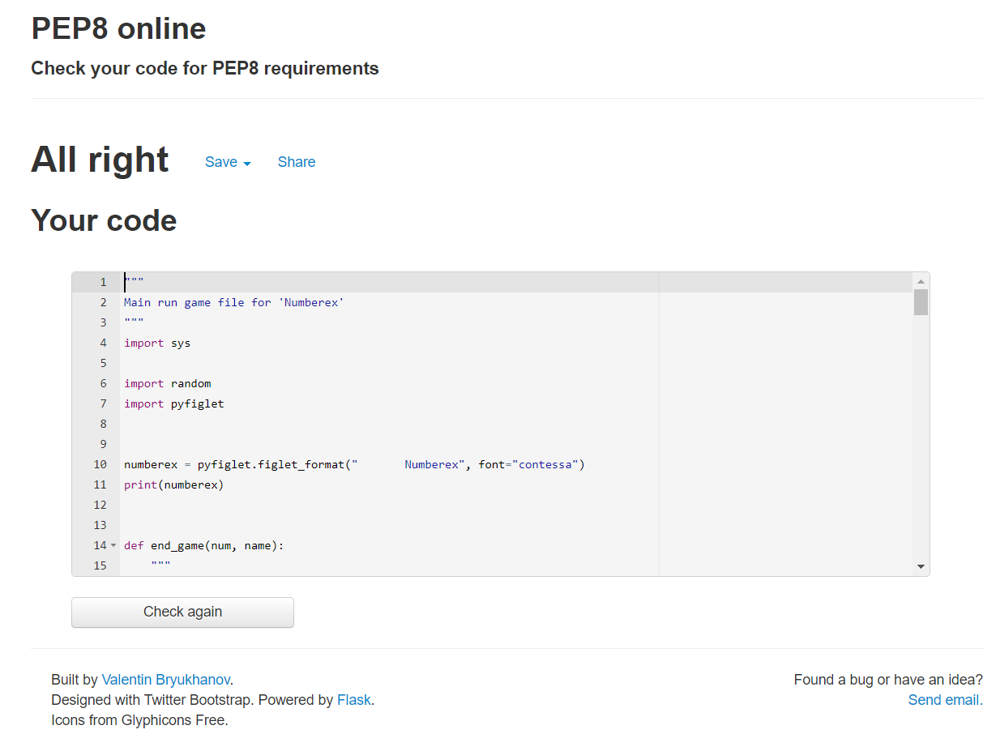

# PORTFOLIO PROJECT - 3

# NUMBEREX

## PURPOSE

'Numberex' is a number guessing game where either, You the user guesses the AI number,
or the AI tries to guess the number you are thinking of.
The project has been developed using Python programming language to create a command line app that will demonstrate the skills I have learnt.
* Here is a link to the [final project](https://numberex.herokuapp.com/)

## INITIAL IDEA CONCEPT

My initial idea for the project was to create a number guessing game to play against the computer or let the computer guess the users number.
The upper number limit can be chosen by the user for difficulty.
#  
## CONTENTS

- [USER STORIES](#user-stories)
- [FEATURES](#features)
    - [Game Components](#the-game-consists-of)
    - [Future Features](#future-features)
- [TESTING](#testing)
    - [Flowchart](#flowchart)
    - [Validation](#validation)
    - [PEP8](#pep8-online-validation)
    - [Solved bugs and errors](#solved-bugs-and-errors)
    - [Unsolved bugs and errors](#unsolved-bugs-or-errors)
    - [FUNCTIONALITY](#functionality)

#

## USER STORIES

* As a user, I want the game to have varying difficulty
* As a user, I want to easily understand the main purpose of the game
* As a user, I want a choice of games
* As a user, I want to be able to see how many lives I have left
* As a user, I want the option to play again

## FEATURES

* The Features I want the game to have are:
    * Allow the user to guess a number between 1 and 10
    * To give an aspect of difficulty with 5 'lives' or attempts
    * If either game is lost or finished, the user will be presented with a restart game option

### The Game consists of:
#### User vs AI

* A terminal with the title `Numberex` and `Enter your name:`
- 
* Once the user name has been entered, `Please choose upper limit` appears
- 
* The user has the option to choose the highest number they wish
- 
* The user is then presented with game rules
- 
* The game starts with `Make a guess between 1 and (number chosen)`
- 
* The user makes a guess, and the game checks if it is correct,
    If the user makes an incorrect guess, they lose a life and must guess again
- 
* If the user has run out of guesses, `Sorry, you ran out of guesses` AI tells the user the number and the game moves to AI guessing
- 
* If the user made the correct guess, they win and the turn moves to AI guessing
- 

### AI vs User

* The user now thinks of a number between 1 and (original number chosen)
* The AI asks the user `MY turn!! Is your number (AI Guess)`
- 
* If the user thinks it is too high, press `h`
- 
* if too high, AI guesses again
* If the user thinks it is too low, press `l`
- 
* If too low, AI guesses again
* If the user thinks the AI guess is correct, press `c`
- 
* If correct, AI shows off by telling you they won

* Option for `Do you want to restart the game [Y/N]` appears
- 
* If the user enters `y`, Game restarts to `Make a guess between 1 and (number chosen)`
- 
* If the user enters `n`, Game ends with `Thank you for playing Numberex!`
- 
### Future features:

* Add AI Guesses (lives) left
* Add an option to choose between AI vs User or User vs AI
* Add how many lives the User or AI had left once correctly guessed the number

* IMAGES
    * There is one background image, for aesthetics only
    [IStockphoto](https://www.istockphoto.com/search/2/image?phrase=numbers)

* TYPOGRAPHY
    * The project uses [Pyfiglet](http://www.figlet.org/examples.html) for the ascii art (title)
    * Otherwise, Standard terminal font, cannot be changed.
# 

# TESTING

* `As a user, I want the game to have varying difficulty`:
    *  After the user inputs his/her name, The option to choose `highest number` will appear to
        provide a personalised level of difficulty. Outcome: `Fulfilled.`
* `As a user, I want to easily understand the main purpose of the game`:
    * Once the user has entered his/her name, and made a choice of difficulty, 
        there will be a paragraph on what the game entails. Outcome: `Fulfilled.`
* `As a user, I want a choice of games`:
    * I have provided two games that run consecutively,
        First: User to guess the AI number
        Second: Ai to guess User number. Outcome: `Fulfilled.`
* `As a user, I want to be able to see how many lives I have left`:
    * After each guess from the user, the terminal will print how many lives (guesses)
        the user has remaining, counting down from five. Outcome: `Fulfilled.`
* `As a user, I want the option to play again`:
    * I have provided an option at the end of the game that asks 
        `Do you want to restart the game? [Y/N]`
        If the user inputs `y`, the game restarts to 
        the User vs AI with the original input difficulty. 
        If the user inputs `n` the game ends with a message `Thank you for playing Numberex!`

## FLOWCHART

Gameplay Flowchart image

 

## FUNCTIONALITY

## Validation
### PEP8 Online Validation

PEP8 Screenshot Results for game run file

 

## SOLVED BUGS AND ERRORS

* 
* Any duplicate or unused code i.e., selectors, classes, id's and elements have been removed
* Any irrelevant space in between code has been removed

## UNSOLVED BUGS OR ERRORS

* The stop button, although it stopped the timer, if the start button was then pressed again, the timer would deduct 4ms and then count past the 0ms into minus figures
    * This was actually due to the `throttleAmount` loop being re-run at the interval of 4ms
        - The error still exists, but, it is such a small amount of time (4 milliseconds) that it is hardly noticeable to the user
* 

#
# TECHNOLOGIES

## DEVELOPMENT

* The project was written and tested using [Gitpod](https://gitpod.io/)
* The project uses [Github](https://github.com/) for utilising git version control
* The project was deployed via [Heroku](https://heroku.com/) 

## LANGUAGES USED

* The project was written using [PYTHON3](https://en.wikipedia.org/wiki/Python_(programming_language))

#
# DEPLOYMENT
## REMOTE DEPLOYMENT:
(Assuming you have already cloned or forked)
* This Game was deployed using GitHub Pages with the following the steps:

1. Click on the `Settings` icon at the top of page in the navigation bar
2. Scroll down until you see `Github Pages`
3. There will be a message box saying `Check it out here` Click on the link to take you to the next page
4. Here you will be greated with a form, `Choose the repository` `Javascript_PP2`
5. Choose the branch in the drop down box, in this case `MAIN`
6. Choose the directory in the next drop down box, in this case `Root`
7. Then click `Save`
8. It may take a few moments for the game to publish, but once live, the box at the top of the page with the site name will turn green and have a `Green` tick to the left of the link to the live page
9. Another way to find the live page is to navigate to settings, on the left menu click on `pages` and this will get you to the same point

* These commands were used for version control during project:

    * git add `example filename` - to add files before committing
    * git commit -m `"example message"` - to commit changes to the local repository
    * git push - to push all committed changes to the GitHub repository
    * git branch - to see which branch currently working on
    * git pull - to pull all code into main branch once the feature branch had been merged and deleted
    * git status - to see if the branch currently working on is upto date or if the are any unstaged

## HOW TO CREATE A BRANCH/TAG OF MAIN:

If you need to `BRANCH` off of the main repository:

1. If you have not already, login in to [GitHub](www.github.com) and go to https://github.com/Chr15w1986/Javascript_PP2
2. On the left side of the screen underneath the nav links, click the drop down box `Main`
3. Inside the box you will see `Create new branch/tag`
4. Inside the text box, enter the new branch or tag name i.e., `Features`
5. Below the Branches Tags tab, you will see `Create branch: Features from "main"`
6. Click on `Create branch: Features from "main"` and you will be taken to the new branch page you just called `Features`

## HOW TO FORK A REPOSITORY:

If you need to `FORK` a repository:

1. If you have not already, login in to [GitHub](www.github.com) and go to https://github.com/Chr15w1986/Javascript_PP2
2. In the top right corner, click `Fork`
3. The next page will be the forked version of https://github.com/Chr15w1986/Javascript_PP2 but in your own repository
## HOW TO CLONE A REPOSITORY:

If you need to make a clone of this repository:

1. Fork the repository https://github.com/Chr15w1986/Javascript_PP2 using the steps above
2. Above the file list, click `Code` (Usually green at the top right of the code window)
3. Choose if you want to clone using HTTPS, SSH or GitHub CLI, then click the copy button to the right
4. Open Git Bash
5. Change the directory to where you want your clone to go (your own github)
6. Type `git clone` and then paste the URL you copied in step 4
7. Press `Enter` to create your clone

## HOW TO MAKE A LOCAL CLONE

If you need to make a local clone:

1. If you have not already, login in to [GitHub](www.github.com) and go to https://github.com/Chr15w1986/Javascript_PP2
2. Under the repository name, above the list of files, click `Code`
3. Here you will have two options, `Clone` or `Download` the repository
4. You should close the repository using HTTPS, clicking on the icon to copy the link
5. At this point, you can launch the `Gitpod workspace` or choose your own directory
5. Open Git Bash
6. Change the current working directory to the new location of where you want the cloned directory to be
7. Type git clone and then paste the URL you copied in step 4
8. Press Enter, to create your local clone to your chosen directory

#
## CREDITS AND REFERENCES

### IMAGE

* Background image, silhouette of a clock was taken from [Pixabay](https://pixabay.com/fi/illustrations/her%c3%a4tyskello-siluetti-kello-musta-2806057/)

### CODE

* [Stackoverflow](https://stackoverflow.com/questions/9647215/what-is-minimum-millisecond-value-of-settimeout) For milliseconds throttle amount code and functions
* [Stackoverflow](https://stackoverflow.com/questions/40638402/why-wont-my-countdown-timer-start-and-stop) For a function idea to get the timer to stop
* [OSTraining](https://www.ostraining.com/blog/coding/stopwatch/) On how to create a stopwatch using javascript
* Everybody on slack for pointing me to [W3Schools](https://www.w3schools.com/) for more indepth guides to the correct syntax and uses of Functions in JAVASCRIPT
#
## ACKNOWLEDGEMENTS:

- Code institute for the Tutors on the course
- My Mentor [Ben Kavanagh](https://github.com/BAK2K3) for his brilliant advice on my code, whether my code is right or wrong, his excellent way with words and constantly believing in me
- Dave Horrocks, for taking time out of his own studies, for his excellent teaching style and expertise on all things javascript.
- My family for their support and patience
- Everybody on Slack for tips, advice, quick fixes and kind words

#### RETURN TO THE [TOP](#one-stop-clock)
issues:
found issue with user vs AI where the user would guess a number between 1 and 10 but if the user guessed 10, AI would say higher, or if user guessed 1 the AI would say lower.

found issue with AI vs user, where there was a double input of the user controls of H L or C, for example, if the user is thinking of 5 and AI guessed 4, I would input H for higher, but two H H would appear on seperate lines.

used pyfiglet for the title Numberex